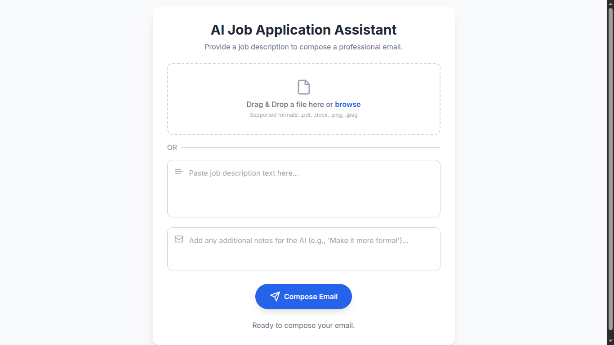

# 💌 AI Job Application Assistant

Welcome to the AI Job Application Assistant! This simple and elegant web application is designed to help you quickly and effortlessly generate a professional and compelling email for a job application. Just provide the job description, and the AI will do the heavy lifting for you.

  

## 🚀 Live Demo

[Check out the live version here!](https://richardili.github.io/Job-Application-Email-Message-Generator-UI/)

## ✨ Features
* **Intelligent Email Composition**: Our AI analyzes job descriptions to compose a tailored application email.
* **Flexible Input**: Paste a job description directly into the text field or upload a file (like a PDF or DOCX) for the AI to process.
* **Seamless Email Sending**: Once the email is composed, you can review and send it directly from the app.
* **Clean and Intuitive Interface**: A minimalist and user-friendly design built with Tailwind CSS ensures a smooth experience.

## 🛠️ Technologies Used
* **Frontend**: The application is a single-page web application built with a modern frontend stack. It uses **HTML5** for its structure and Vanilla JavaScript (without any complex frameworks like React or Angular) for all of its logic and interactive behavior. The styling is handled by **Tailwind CSS**, a utility-first CSS framework that provides pre-built classes to create a clean and responsive user interface directly in the **HTML**. It also uses a custom font, Inter, for typography.

* **Backend / API**: The application is dependent on an external backend service to handle the core functionality: composing and sending the email. This is an API hosted at https://job-application-email-message-generator.onrender.com/api. The apiService.js file handles all communication with this backend, making POST requests to its endpoints to send data and receive the generated email. The server-side code is not visible in the provided files, but it is responsible for the AI-powered text generation and the actual email sending process.

## 🧠 What I Learned

* **Modular JavaScript**: Instead of having one massive JavaScript file, I learned to break the code into smaller, more manageable modules (apiService.js, fileHandler.js, modalManager.js, uiManager.js). This makes the code easier to read, debug, and maintain. For example, the uiManager.js file now handles all UI-related state changes, like showing and hiding loaders or updating button text.

* **Event Handling & Callbacks**: I learned how to use event listeners (addEventListener) and callback functions to manage user interactions. In the fileHandler.js, the setupFileListeners function takes a callback to update the main application state in app.js. This is a clean way to separate concerns between different parts of the application.

* **Responsive and Utility-First CSS**: The use of Tailwind CSS was a key learning point. I found that I could style the entire application directly in the HTML using utility classes like p-8, shadow-xl, and text-center. This approach makes it easy to build a modern, responsive interface without writing any custom CSS. The design adapts well to different screen sizes without needing to write complex media queries.

* **API Interaction with fetch**: The project relies on a backend API for its core functionality. I learned how to use the modern fetch API to make POST requests, both with FormData for file uploads and with JSON for sending the final email data. This is a fundamental skill for building any web application that needs to communicate with a server.

